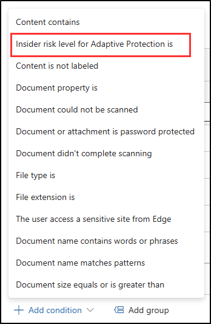

# Bonus – Implement Adaptive Protection

After testing the DLP policies, Megan Bowen, the Information Security Administrator at Contoso Ltd., notices that blocking all users creates unnecessary friction. Leadership wants restrictions applied only to users showing risky AI activity. To meet this requirement, Megan will use Adaptive Protection to dynamically enforce the DLP policy for users flagged by Insider Risk Management.

**Tasks**:

1. Add Adaptive Protection to a DLP rule
1. Create a risky AI usage policy
1. Enable Adaptive Protection for DLP

## Task 1 – Add Adaptive Protection to a DLP rule

In this task, you'll edit a DLP policy so it applies only when a user has an elevated insider risk level.

1. In the Microsoft Purview portal, go to **Solutions** > **Data Loss Prevention** > **Policies**.

1. On the **Policies** page, select the **Block AI website uploads on devices** policy, then select **Edit policy** from the command bar.

1. On the **Name your DLP policy** page, select **Next** until you reach the **Customize advanced DLP rules** page.

1. On the **Customize advanced DLP rules** page, find the **Block AI website uploads** rule you created in a previous task.

1. To the right of the rule, select the **Edit** (pencil) icon to open it for editing.

1. In the **Edit rule** flyout, in the **Conditions** section, select **+ Add condition** > **Insider risk level for Adaptive Protection is**.
in this task
   

1. In the new **Insider risk level for Adaptive Protection is** section, select the dropdown for **Select one or more risk levels**, then select **Elevated risk level**.

1. Select **Save** at the bottom of the **Edit rule** flyout.

1. Back on the **Customize advanced DLP rules** page, select **Next** until you reach the **Review and finish** page.

1. On the **Review and finish** page, select **Submit**.

1. On the **Policy updated** page, select **Done**.

You've updated the DLP rule so it only applies to users at an elevated insider risk level. This lets you target protections more precisely.

## Task 2 – Create a risky AI usage policy

In this task, you'll create a quick policy that detects risky AI activity. This policy will feed risk signals into Adaptive Protection.

1. In the Microsoft Purview portal, navigate to **Solutions** > **Insider Risk Management** > **Policies**.

1. Select **+ Create policy** > **Quick policy**.

1. On the **Create quick policies** flyout, in the **Risky AI Usage** card, select **Get started**.

   

1. In the **Create a risky AI usage policy** flyout, leave the default **Policy name** and **User scope**, then select **Create policy**.

1. On the **Your risky AI usage policy is being created** page, select **Done**.

You've created a quick policy that detects risky AI usage. It will raise insider risk signals that Adaptive Protection can use.

## Task 3 – Enable Adaptive Protection for DLP

In this task, you'll connect the risky AI usage policy to risk levels and enable Adaptive Protection so your DLP policy is enforced dynamically.

1. In the Microsoft Purview portal, go to **Solutions** > **Insider Risk Management** > **Adaptive Protection**.

1. From the left navigation, select **Insider risk levels**.

1. On the **Insider risk levels** page:

   - In the **Insider risk policy** dropdown, select the Risky AI usage quick policy you created in the previous task.
   - Leave the default risk level settings unchanged.
   - Select **Save**.

1. From the left navigation, on the **Adaptive Protection** page, select **Data Loss Prevention**.

1. Verify the **Block AI website uploads on devices** policy appears on the page.

1. From the left navigation, on the **Adaptive Protection** page, select **Adaptive Protection settings**.

1. Set the toggle to **On** under **Adaptive Protection** to enable Adaptive Protection.

You enabled Adaptive Protection so your DLP safeguards are enforced only when users show risky AI activity. This dynamic enforcement reduces friction for most users while still protecting sensitive data when risks arise.
