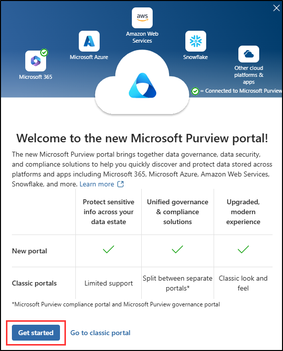
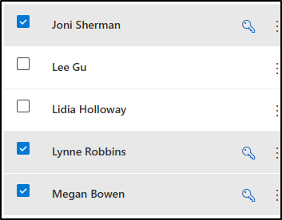
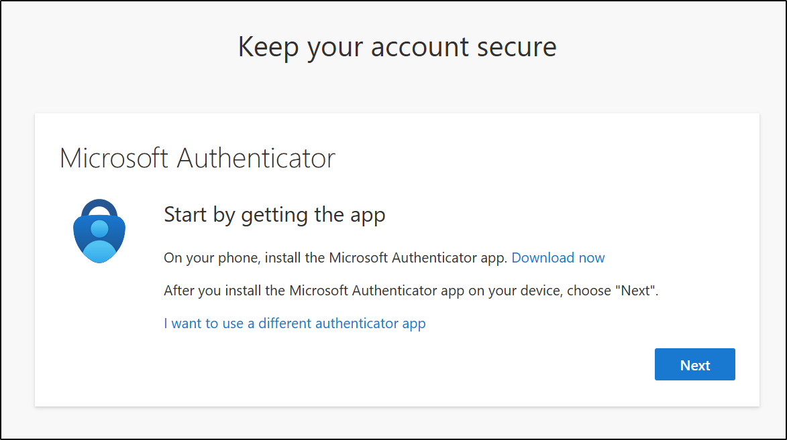

---
lab:
    title: 'Lab setup - Prepare your environment for administration'
    module: 'Lab setup'
---

## WWL Tenants - Terms of use

If you are being provided with a tenant as a part of an instructor-led training delivery, please note that the tenant is made available for the purpose of supporting the hands-on labs in the instructor-led training.

Tenants should not be shared or used for purposes outside of hands-on labs. The tenant used in this course is a trial tenant and cannot be used or accessed after the class is over and are not eligible for extension.

Tenants must not be converted to a paid subscription. Tenants obtained as a part of this course remain the property of Microsoft Corporation and we reserve the right to obtain access and repossess at any time.

# Lab setup - Prepare your environment for administration

In this lab, you'll configure and prepare your environment for administration tasks. You'll enable required features, configure permissions, and prepare core services for administration.

**Tasks:**

1. Enable Audit in the Microsoft Purview portal  
1. Enable device onboarding  
1. Enable insider risk analytics and data sharing  
1. Set user passwords for lab exercises  
1. Initialize Microsoft Defender XDR

## Task 1 - Enable Audit in the Microsoft Purview portal

In this task, you'll enable Audit in the Microsoft Purview portal to monitor portal activities.

1. Log into Client 1 VM (SC-401-CL1) as the **SC-401-CL1\admin** account and logged into Microsoft 365 with the MOD Administrator account.

1. In Microsoft Edge, navigate to the Microsoft Purview portal, `https://purview.microsoft.com`, and log in.

1. A message about the new Microsoft Purview portal will appear on the screen. Select **Get started** to access the new portal.

    

1. Select **Solutions** from the left sidebar, then select **Audit**.

1. On the **Search** page, select the **Start recording user and admin activity** bar to enable audit logging.

    

1. Once you select this option, the blue bar should disappear from this page.

> [!note] **If the Audit button doesn't enable logging**
>
> In some tenants, selecting **Start recording user and admin activity** might not activate Audit.  
>
> If this occurs, you can enable Audit through PowerShell instead:
>
> 1. Open an elevated Terminal window by right-clicking the Windows button and selecting **Terminal (Admin)**.  
>
> 1. Install the latest **Exchange Online PowerShell** module:
>
>    ```powershell
>    Install-Module ExchangeOnlineManagement
>    ```
>
>    Confirm any prompts by typing **Y** for Yes and pressing **Enter**.
>
> 1. Run the following command to change your execution policy:
>
>    ```powershell
>    Set-ExecutionPolicy -ExecutionPolicy RemoteSigned -Scope CurrentUser
>    ```
>
> 1. Close the elevated Terminal window and open a regular PowerShell session.
>
> 1. Connect to Exchange Online:
>
>    ```powershell
>    Connect-ExchangeOnline
>    ```
>
>    Sign in as `admin@WWLxZZZZZZ.onmicrosoft.com` (replace ZZZZZZ with your tenant ID).
>
> 1. Check if Audit is enabled:
>
>    ```powershell
>    Get-AdminAuditLogConfig | FL UnifiedAuditLogIngestionEnabled
>    ```
>
>    If it returns `False`, enable Audit:
>
>    ```powershell
>    Set-AdminAuditLogConfig -UnifiedAuditLogIngestionEnabled $true
>    ```
>
> 1. Verify that it's now enabled:
>
>    ```powershell
>    Get-AdminAuditLogConfig | FL UnifiedAuditLogIngestionEnabled
>    ```
>
>    The command should return `True` once Audit is active.

You have successfully enabled auditing in Microsoft 365.

## Task 2 – Enable device onboarding

In this task, you'll enable device onboarding for your organization.

1. You should still be logged into Client 1 VM (SC-401-CL1) as the **SC-401-CL1\admin** account and logged in as the MOD Administrator in Microsoft 365.

1. In **Microsoft Edge**, navigate to **`https://purview.microsoft.com`** to log into Microsoft Purview, then select **Settings** from the left sidebar.

1. In the left sidebar, expand **Device onboarding** then select **Devices**.

1. On the **Devices** page, select **Turn on device onboarding** then select **Ok** to enable device onboarding.

1. When prompted, select **OK** to confirm that device monitoring is being turned on.

You have now enabled device onboarding and can start to onboard devices to be protected with Endpoint DLP policies. The process of enabling the feature might take up to 30 minutes.

## Task 3 – Enable insider risk analytics and data sharing

In this task, you'll enable analytics and data sharing for Insider Risk Management.

1. You should still be logged into Client 1 VM (SC-401-CL1) as the **SC-401-CL1\admin** account and logged in as the MOD Administrator in Microsoft Purview.

1. In Microsoft Purview, navigate to **Settings** > **Insider Risk Management** > **Analytics**.

1. Toggle these settings to **On**:

   - **Show insights at tenant level**

   - **Show insights at user level**

1. Select **Save** at the bottom of the page.

1. Select **Data sharing** on the left navigation pane.

1. In the Data sharing section, toggle **Share user risk details with other security solutions** to **On**.

1. Select **Save** at the bottom of the page.

You have enabled analytics and data sharing for Insider Risk Management.

## Task 4 - Set user passwords for lab exercises

In this task, you'll set passwords for the user accounts needed for the labs.

1. You should still be logged into Client 1 VM (SC-401-CL1) as the **SC-401-CL1\admin** account and logged in as the MOD Administrator in Microsoft 365.

1. Open **Microsoft Edge** and navigate to **`https://admin.microsoft.com`** to log into the Microsoft 365 admin center as the MOD Administrator, `admin@WWLxZZZZZZ.onmicrosoft.com` (where ZZZZZZ is your unique tenant ID provided by your lab hosting provider).

> [!note] **Note**: In some tenants, you might see a Portal MFA Enforcement prompt when signing in. If this prompt appears:
>
> - Select **Skip for now** to temporarily delay MFA setup.
>
>   
>
> - On the **Let us know why you're skipping MFA** dialogue, select any justification, then select **Send and skip**.
>
> This postpones MFA enforcement in the Microsoft 365 Admin center for the tenant and allows you to proceed with the lab.

1. On the left navigation pane, expand **Users** then select **Active users**.

1. Select the checkbox to the left of **Joni Sherman**, **Lynne Robbins**, and **Megan Bowen**.

   These accounts will be used throughout the lab exercises.

   

1. Select the **Reset password** button from the top navigation to reset all three passwords.

   

1. In the **Reset Password** flyout page on the right, ensure that both checkboxes are deselected.

   This will ensure that you can select a password for the three users being used for exercises, and that these passwords won't need to be reset when you first sign in.

1. In the **Password** field, enter a password you can remember to reset the user passwords to be used in future exercises.

1. At the bottom of the **Reset password** flyout page, select the **Reset password** button.

1. On the **Passwords have been reset** page, you should see the three user accounts that have been reset. At the bottom of this flyout page, select **Close**.

You have successfully reset passwords for lab exercises.

## Task 5 – Initialize Microsoft Defender XDR

In this task, you'll open Microsoft Defender and wait for Microsoft Defender XDR to finish initializing.

1. You should still be logged into Client 1 VM (SC-401-CL1) as the **SC-401-CL1\admin** account and logged in as the MOD Administrator in Microsoft Purview.

1. In **Microsoft Edge**, navigate to **`https://security.microsoft.com/`** to open Microsoft Defender.

1. From the navigation pane, select **Investigation & response** > **Incidents & alerts** > **Incidents**.

> [!note] **Note**: The Microsoft Defender XDR initialization screen might or might not appear depending on your lab tenant. If it appears, you can continue with other tasks while it completes in the background.

1. You'll see a message stating that Microsoft Defender XDR is being prepared. This process runs automatically and might take a few minutes.

   

Microsoft Defender XDR is being initialized. You can continue with other tasks while it finishes setting up.

## Task 6 – Configure multi-factor authentication in Microsoft Entra

In this task, you'll configure multi-factor authentication (MFA) for the admin account to secure access to Microsoft Entra and other Microsoft 365 services.

1. In **Microsoft Edge**, navigate to **`https://entra.microsoft.com/`** to open Microsoft Entra.

1. On the **Start by getting the app** screen, install the **Microsoft Authenticator** app from your device's app store, or open it if it's already installed.

   

   - If you prefer a different app, select **I want to use a different authenticator app** and follow the on-screen instructions.

1. Select **Next**.

1. On the **Set up your account** screen, follow the instructions on your phone to allow notifications, then select **Next**.  

   - If you already have the Microsoft Authenticator app installed and configured, you might not see this screen. In that case, continue to the next step.

1. On the **Scan the QR code** screen, use the Microsoft Authenticator app on your device to scan the QR code displayed on your screen, then select **Next**.

1. On your phone, approve the sign-in request by entering the number shown on your browser.

1. After approving the request, the **Notification approved** screen will appear. Select **Next**.

1. On the **Success!** screen, verify that your **Default sign-in method** shows **Microsoft Authenticator**, then select **Done**.

1. When prompted to sign in again, approve the sign-in request on your phone to verify your identity.

1. After the approval completes, you'll be redirected to the **Microsoft Entra admin center**.

You've successfully configured and verified multi-factor authentication for the admin account in Microsoft Entra.
