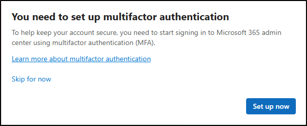

---
lab:
    title: 'Exercise 1 - Manage compliance and security roles'
    module: 'Module 1 - Implement Information Protection'
---
## WWL Tenants - Terms of use

If you are being provided with a tenant as a part of an instructor-led training delivery, please note that the tenant is made available for the purpose of supporting the hands-on labs in the instructor-led training.

Tenants should not be shared or used for purposes outside of hands-on labs. The tenant used in this course is a trial tenant and cannot be used or accessed after the class is over and are not eligible for extension.

Tenants must not be converted to a paid subscription. Tenants obtained as a part of this course remain the property of Microsoft Corporation and we reserve the right to obtain access and repossess at any time.

# Lab 1 - Exercise 1 - Manage compliance and security roles

As the recently hired Information Security Administrator for Contoso Ltd., you (Joni Sherman) need to ensure the new Microsoft 365 tenant complies with various legal and regulatory standards. Contoso Ltd. is expanding, and your role is crucial to maintaining compliance across its regions.

**Tasks**:

1. Assign administrative roles
1. Explore the Microsoft Purview portal

**Estimated time:** 15-25 minutes

## Task 1 – Assign administrative roles

In this task, you'll assign the required compliance and security roles to Joni Sherman.

1. Log into the Client 1 VM (SC-401-CL1) as the **SC-401-CL1\admin** account. The password should be provided by your lab hosting provider.

1. Open **Microsoft Edge** and navigate to the Microsoft 365 admin center, `https://admin.microsoft.com`, and log in as **MOD Administrator**, `admin@WWLxZZZZZZ.onmicrosoft.com` (where ZZZZZZ is your unique tenant prefix provided by your lab hosting provider). Admin's password should be provided by your lab hosting provider.

    > [!Note] **Note: Skip MFA for the Microsoft 365 Admin center**
    >
    > In some tenants, you might see a Portal MFA Enforcement prompt when signing in. If this prompt appears:
    >
    > - Select **Skip for now** to temporarily delay MFA setup.
    >
    >    
    >
    > - On the **Let us know why you're skipping MFA** dialogue, select any justification, then select **Send and skip**.
    >
    > This postpones MFA enforcement in the Microsoft 365 Admin center for the tenant and allows you to proceed with the lab.

1. On the left sidebar, expand **Users** then select **Active users**.

1. On the **Active users** page, search for `Joni`, then select **Joni Sherman**.

1. The properties for Joni's account are displayed in a flyout panel on the right. Select **Manage roles** on the flyout panel.

1. On the **Manage admin roles** panel, select **Admin center access**, then scroll down to expand **Show all by category**.

1. Under the **Identity** category, select the checkbox for:

    - **Application Administrator**

1. Under the **Security & Compliance** category, select the checkboxes for:

    - **Compliance Administrator**
    - **Security Administrator**

1. Select **Save changes** at the bottom of the flyout panel.

1. You should see a message: **Admin roles updated**.

1. On the **Manage admin roles** page, select the **X** on the top right corner of the flyout panel to close the panel.

1. Sign out of the MOD Administrator account by selecting the **MA** icon in the top right, then select **Sign out**.

   

You have successfully assigned Joni Sherman the Compliance and Security Administrator roles, which is required to complete the tasks in this lab.

## Task 2 – Explore the Microsoft Purview portal

In this task, you'll sign in as Joni Sherman to explore the Microsoft Purview portal.

1. You should still be logged into your Client 1 VM (SC-401-CL1) as the **SC-401-CL1\admin** account.

1. In **Microsoft Edge**, navigate to **`https://purview.microsoft.com`**.

1. When the **Pick an account** window is displayed, select **Use another account**.

1. When the **Sign in** window is displayed, sign in as `JoniS@WWLxZZZZZZ.onmicrosoft.com` (where ZZZZZZ is your unique tenant prefix provided by your lab hosting provider). User account passwords are provided by your lab hosting provider.

1. A message about the new Microsoft Purview portal will appear on the screen. Select **Get started** to access the new portal.

1. Explore the layout and navigation of the new Microsoft Purview portal. Leave the browser window open when you're finished.

You have successfully signed in as Joni Sherman and are ready to continue the lab.
