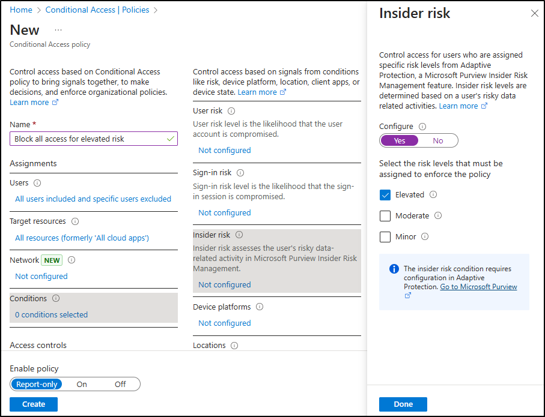

---
lab:
    title: 'Exercise 2 - Implement Adaptive Protection'
    module: 'Module 3 - Implement Insider Risk Management'
---

# Lab 3 - Exercise 2 - Implement Adaptive Protection

You are Joni Sherman, the Compliance Administrator for Contoso Ltd. Your role involves ensuring regulatory compliance and protecting sensitive information within the organization. Recently, Contoso Ltd. has noticed unusual browsing activities that could potentially expose sensitive data. To proactively address this insider risk, you will implement Microsoft Purview Insider Risk Management, focusing on identifying, analyzing, and responding to potential insider threats effectively.

**Tasks**:

## Task 1 – assign irm policy to adaptive protection

1. Log into the Client 1 VM (SC-400-CL1) as the **SC-400-cl1\admin** account.

1. In **Microsoft Edge**, navigate to **`https://purview.microsoft.com`** and sign in as **Joni Sherman** `JoniS@WWLxZZZZZZ.onmicrosoft.com` (where ZZZZZZ is your unique tenant ID provided by your lab hosting provider).

1. In the Microsoft Purview portal, navigate to **Solutions** > **Insider Risk Management** > **Adaptive Protection**.

1. From the left navigation pane, select **Insider risk levels**.

1. On the **Insider risk levels** page:

   - In the Insider risk policy dropdown, select **Data leaks quick policy** you created in a previous exercise.
   - Leave the default risk level settings as is.
   - Select **Save**.

## Task 2 – Configure adaptive protection settings for your DLP policy

1. In Microsoft Purview, navigate to **Solutions** > **Data Loss Prevention** > **Policies**.

1. On the **Policies** page, select the checkbox for the **DLP - Credit Card Protection** policy created in a previous exercise, then select **Edit policy**.

1. In the DLP configuration, select **Next** until you reach the **Customize advanced DLP rules** page.

1. Select the pencil icon next to the **Credit card information rule** to edit it.

1. On the **Edit rule** page:
   - Update the **Description** to: `Block sharing of credit card data when user has an elevated insider risk level.`
   - In the **Conditions** section, then select **Add condition** > **Insider risk level for Adaptive Protection is**.
   - In the new section, select **Elevated Risk**.
   - Under **Actions**, update the **Restrict access or encrypt the content in Microsoft 365** action to **Block everyone**.
   - Select **Save** to update the rule.

1. Back on the **Customize advanced DLP rules** page, select **Next**.

1. On the **Policy mode** page, keep the policy active, then select **Next**.

1. On the **Review and finish** page, select **Submit**, then select **Done** once your policy is updated.

## Task 3 – Optional: Configure Conditional Access with Adaptive Protection

1. In Microsoft Purview, sign out of Joni's account and close all browser windows.

1. Open a new Microsoft Edge window and navigate to the **Microsoft Entra admin center** at `https://entra.microsoft.com`. Sign in as the **MOD Administrator**, `admin@WWLxZZZZZZ.onmicrosoft.com` (where ZZZZZZ is your unique tenant ID provided by your lab hosting provider). The Admin password should be provided by your lab hosting provider.

1. On the **More information required** page, select **Next**.

1. On the **Keep your account secure** page, follow the prompts to set up multi-factor authentication (MFA) using either Microsoft Authenticator or another authentication app.

   After completing MFA setup, you'll be taken to the **Microsoft Entra admin center**.

1. In the Microsoft Entra admin center, navigate to **Protection** > **Conditional Access** > **Policies**.

1. On the **Policies** page, select **+ New policy**.

1. On the **New policy** page, name your policy: `Block all access for elevated risk`.

1. Under **Assignments**, configure the **Users** section:

   - **Include**: All users  
   - **Exclude**: `Joni Sherman` and `MOD Administrator`

     

1. Under **Target resources**, confirm the dropdown is set to **Resources (formerly cloud apps)** and select **All resources (formerly 'All cloud apps')**.

     

1. Under **Conditions**, select **Insider risk**. Set **Configure** to **Yes**, then set the risk level to **Elevated**.

     

1. Under **Access controls**, select **Grant**. Choose **Block access**, then select **Select** at the bottom of the flyout.

     

1. At the bottom of the page, confirm **Enable policy** is set to **Report-only**, then select **Create**.

1. Back on the **Policies** page for Conditional Access, select **Refresh** to verify your newly created policy appears.

1. Sign out of the Mod Administrator account by selecting the MA icon on the top right of the window, then selecting **Sign out** and close all browser windows.

## task 4 - go back to adaptive protection

1. Open **Microsoft Edge** and navigate to **`https://purview.microsoft.com`** and sign in as **Joni Sherman** `JoniS@WWLxZZZZZZ.onmicrosoft.com` (where ZZZZZZ is your unique tenant ID provided by your lab hosting provider).

1. Navigate to **Solutions** > **Insider Risk Management** > **Adaptive Protection**.

1. Verify your settings:

   - Select the **Insider risk levels** tab and verify your **Data leaks quick policy** is selected.

   - (Optional) Select the **Conditional Access** tab and verify your **Block all access for elevated risk** policy is visible.

   - Select the **Data Loss Prevention** tab and verify your **Credit Card Protection** is visible.

1. Select the **Adaptive Protection settings** tab and toggle **Adaptive Protection** to **On**.

1. Select **Save**.

