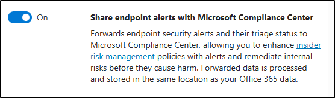

---
lab:
  title: Exercise 1 - Implement Insider Risk Management
  module: Module 4 - Implement Insider Risk Management
  description: Configure Insider Risk Management by assigning roles, enabling indicators, creating policies, integrating Defender signals, and setting up priority users and notifications.
  duration: 120 minutes
  level: 200
  islab: true
  primarytopics:
    - Microsoft Purview
---

## WWL Tenants - Terms of use

If you are being provided with a tenant as part of an instructor-led training delivery, please note that the tenant is made available for the purpose of supporting the hands-on labs in the instructor-led training.

Tenants should not be shared or used for purposes outside of hands-on labs. The tenant used in this course is a trial tenant and cannot be used or accessed after the class is over and is not eligible for extension.

Tenants must not be converted to a paid subscription. Tenants obtained as part of this course remain the property of Microsoft Corporation and we reserve the right to obtain access and repossess at any time.

# Lab 4 - Exercise 1 - Implement Insider Risk Management

You are Joni Sherman, the Information Security Administrator for Contoso Ltd. Your role involves ensuring regulatory compliance and protecting sensitive information within the organization. Recently, Contoso Ltd. has noticed unusual browsing activities that could potentially expose sensitive data. To proactively address this insider risk, you will implement Microsoft Purview Insider Risk Management, focusing on identifying, analyzing, and responding to potential insider threats effectively.

**Tasks**:

1. Assign insider risk management permissions
1. Configure policy indicators
1. Create a data leaks policy
1. Enable Microsoft Defender for Endpoint integration with Insider Risk Management
1. Enable Defender indicators and configure priority users
1. Create a policy for security policy violations by priority users
1. Create a notice template

**Estimated time:** 90-120 minutes

## Task 1 – Assign insider risk management permissions

In this task, you'll assign Joni Sherman the Insider Risk Management role so she can access and manage insider risk features in Microsoft Purview.

1. Sign into the Client 1 VM (SC-401-CL1) as the **SC-401-CL1\admin** account.

1. Open **Microsoft Edge** in an InPrivate window by right-clicking Microsoft Edge from the task bar and selecting **New InPrivate window**.

1. Navigate to **`https://purview.microsoft.com`** and sign into the Microsoft Purview portal as MOD Administrator, `admin@WWLxZZZZZZ.onmicrosoft.com` (where ZZZZZZ is your unique tenant prefix provided by your lab hosting provider). Admin's password should be provided by your lab hosting provider.

1. Select **Settings** > **Roles and Scopes** > **Role groups**.

1. On the **Role groups for Microsoft Purview solutions** page, select **Insider Risk Management**.

1. On the **Insider Risk Management** flyout panel, select the **Members** tab. Select **+ Add member**, then select **Choose users**.

1. On the **Choose users** flyout panel, search for `Joni`, then select the checkbox for **Joni Sherman**.

1. Select **Select** at the bottom of the panel.

1. Back on the **Insider Risk Management** flyout panel, verify **Joni Sherman** appears as a member.

1. Select **Done**, then select **Confirm** to update the role group.

1. Close the InPrivate window.

You've assigned Joni the necessary permissions to work with Insider Risk Management in the Microsoft Purview portal.

## Task 2 – Configure policy indicators

Before you create insider risk policies, you need to enable the indicators that define which user activities the system monitors. Enabling them upfront ensures your policies can use sequence detection and built-in thresholds without additional configuration.

1. In Microsoft Edge, navigate to **`https://purview.microsoft.com`** and sign in as `JoniS@WWLxZZZZZZ.onmicrosoft.com` (where ZZZZZZ is your unique tenant prefix provided by your lab hosting provider). User account passwords are provided by your lab hosting provider.

1. Select **Settings** > **Insider risk management**.

1. Select the tab on the left for **Policy indicators**.

1. On the **Policy indicators** page, expand each of the following categories and select **Select all** to enable all indicators:

   - Office indicators
   - Device indicators
   - Cumulative exfiltration detection

   > **Note: Greyed-out categories**<br>Some categories, such as Microsoft Defender for Endpoint indicators, require additional integration before they can be enabled. You'll configure that integration and enable those indicators in a later task.

1. Select **Save** at the bottom of the page.

You've enabled the core policy indicators for insider risk detection. Office indicators track file activity in Microsoft 365 apps, device indicators cover USB and print operations, and cumulative exfiltration detection identifies activity that exceeds normal baselines.

## Task 3 – Create a data leaks policy

In this task, you'll create a policy from the Data leaks template to detect risky data exfiltration. This policy uses the Office, device, and exfiltration indicators you enabled in Task 2 to identify patterns like file downloads followed by USB copies or cloud uploads.

1. In Microsoft Purview, select **Solutions** > **Insider Risk Management** > **Policies**.

1. On the **Policies** page, select **+ Create policy**, then select **Custom policy**.

1. On the **Choose a policy template** page, select **Data leaks**, then select **Next**.

1. On the **Name your policy** page, enter:

   - **Name**: `Data leaks policy`
   - **Description**: `Detects risky data exfiltration activity using Office, device, and cumulative exfiltration indicators.`

1. Select **Next**.

1. On the **Choose users, groups, & adaptive scopes** page, select **Next**.

1. On the **Exclude users and groups (optional) (preview)** page, select **Next**.

1. On the **Decide whether to prioritize content** page, select **I don't want to prioritize content right now**, then select **Next**.

1. On the **Choose triggering event for this policy** page, review the available sequences. The sequences listed here rely on the indicators you enabled in Task 2 — each one combines multiple signals to detect coordinated data movement.

1. Select **Next**.

1. On the **Choose thresholds for triggering events** page, select **Next**.

1. On the **Indicators** page, select **Next**.

1. On the **Detection options** page, select **Next**.

1. On the **Choose threshold type for indicators** page, select **Next**.

1. On the **Review settings and finish** page, select **Submit**.

1. On the **Your policy was created** page, select **Done**.

1. Back on the **Policies** page, verify your data leaks policy has a **Healthy** status.

You've created a data leaks policy that uses sequence-based triggers and the indicators configured in Task 2 to detect risky data exfiltration patterns.

## Task 4 – Enable Microsoft Defender for Endpoint integration with Insider Risk Management

In this task, you'll enable integration between Microsoft Defender for Endpoint and Microsoft Purview so security alerts can be used in insider risk policies.

1. In Microsoft Edge, navigate to Microsoft Defender by going to **`https://security.microsoft.com`**.

1. In the left navigation pane, select **System** > **Settings** > **Endpoints** > **Optional features**.

1. Scroll down and select the toggle to **On** to **Share endpoint alerts with Microsoft Compliance Center**.

   

1. Select **Save preferences** at the bottom of the screen.

You've successfully enabled Defender for Endpoint to share alerts with Microsoft Purview.

## Task 5 – Enable Defender indicators and configure priority users

With Defender for Endpoint integration active, you can now enable the security-specific indicators that feed security policy violations policies. You'll also create a priority user group to target monitoring for high-risk roles.

> **Note: Defender for Endpoint indicator availability**<br>Microsoft Defender for Endpoint indicators might appear greyed out and unselectable if the integration from the previous task hasn't finished processing. If that happens, wait a few minutes and refresh the page before continuing.

1. In **Microsoft Edge**, navigate to **`https://purview.microsoft.com`**.

1. Select **Settings** > **Insider risk management**.

1. Select the tab on the left for **Policy indicators**.

1. On the **Policy indicators** page, expand and select **Select all** to enable all indicators in these categories:

   - Microsoft Defender for Endpoint indicators
   - Risky browsing indicators (preview)

1. Select **Save** at the bottom of the page.

1. Select the **Priority user groups** tab, then select **+ Create priority user group**.

1. On the **Name and describe the priority user group** page, enter:

   - **Name**: `Finance team`
   - **Description**: `Team members who manage financial operations, budgeting, and payroll systems.`

1. Select **Next**.

1. On the **Members** page, select **+ Members**.

1. In the **Members** flyout, search for and select:

   - `Lynne Robbins`
   - `Debra Berger`
   - `Megan Bowen`

1. Select **Add** to add the three members to the Finance team priority group.

1. Select **Next**.

1. On the **Choose who can view data involving users in this priority group**, select **+ Choose users and role groups**.

1. In the flyout, select the **Insider Risk Management** role group. This allows members of the role group, including Joni, to view data involving users in this priority group. Select **Add**.

1. Select **Next**.

1. **Review** and **Submit** your settings, then select **Done** once your priority user group has been created.

You've enabled Defender-based indicators for detecting security policy violations and created a priority user group for targeted monitoring.

## Task 6 – Create a policy for security policy violations by priority users

In this task, you'll create an insider risk policy that uses the Defender for Endpoint indicators you enabled in Task 5 to detect security-related events — such as disabled protections or malware — for priority users.

1. In Microsoft Purview, select **Solutions** > **Insider Risk Management** > **Policies**.

1. On the **Policies** page, select **+ Create policy**, then select **Custom policy**.

1. On the **Choose a policy template** page, select **Security policy violations by priority users**, then select **Next**.

1. On the **Name your policy** page, enter:

   - **Name**: `Security policy violations - Priority users`
   - **Description**: `Detects Defender for Endpoint alerts for risky activity by priority users, such as malware or disabled protections.`

1. Select **Next**.

1. On the **Choose users, groups, & adaptive scopes** page, select **Add or edit priority user groups**.

1. On the **Choose priority user groups** flyout, select the checkbox for the **Finance team** group, then select **Add**.

1. Select **Next**.

1. On the **Decide whether to prioritize content** page, select **Next**.

1. On the **Choose triggering event for this policy** page, select **Next**.

1. On the **Indicators** page, select **Next**.

1. On the **Choose threshold type for indicators** page, leave the default **Apply thresholds provided by Microsoft** option selected, then select **Next**.

1. On the **Review settings and finish** page, select **Submit**.

1. On the **Your policy was created** page, select **Done**.

1. Back on the **Policies** page, select **Security policy violations - Priority users** and confirm the policy status is **Healthy**.

You've created a custom insider risk policy that uses Defender for Endpoint signals to detect risky activity from priority users. When an alert from this policy is triaged, an investigator can use a notice template to communicate with the user. In the next task, you'll create that reusable response asset.

## Task 7 – Create a notice template

Notice templates are created separately from insider risk policies and selected when an investigator communicates with a user about a triaged alert. In this task, you'll create a reusable template for security policy violation alerts generated by the priority-user policy.

1. In Microsoft Purview, select **Solutions** > **Insider Risk Management** > **Users** > **Notice templates**.

1. On the **Notice templates** page, select **+ Create notice template**.

1. Fill out the necessary information in the **Create a new notice template** flyout panel on the right.

    - **Template name**: `Security Violation Alert`
    - **Send from**: `Joni Sherman`
    - **Subject**: `Unusual activity detected - please review`
    - **Message body**:

        ````html
        <!DOCTYPE html>
        <html>
        <body>
        <h2>Security Alert</h2>
        <p>We've detected activity from your account that might violate our organization's security policies. This could be due to malware, disabled protections, or other risky behavior.</p>
        <p>Please review your recent actions and ensure your device security settings are up to date. If you believe this alert was generated in error, contact the IT Security team for assistance.</p>
        <p>To avoid future issues, refer to the <a href="https://contoso.com/security-guidelines">Contoso Security Guidelines</a>.</p>
        <p>Thank you,</p>
        <p><em>Compliance and Security Team</em></p>
        </body>
        </html>
        ````

1. Select **Create**.

1. Back on the **Notice templates** page, you'll see the **Security Violation Alert** template you just created.

You've created the **Security Violation Alert** notice template. It is now available for an investigator to select when communicating with a user about a relevant insider risk alert.
