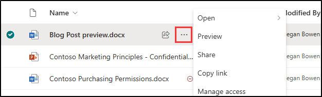

---
lab:
    title: 'Exercise 1 - Configure Retention Policies'
    module: 'Module 5 - Implement and manage retention'
---

## WWL Tenants - Terms of use

If you are being provided with a tenant as a part of an instructor-led training delivery, please note that the tenant is made available for the purpose of supporting the hands-on labs in the instructor-led training.

Tenants should not be shared or used for purposes outside of hands-on labs. The tenant used in this course is a trial tenant and cannot be used or accessed after the class is over and are not eligible for extension.

Tenants must not be converted to a paid subscription. Tenants obtained as a part of this course remain the property of Microsoft Corporation and we reserve the right to obtain access and repossess at any time.


-------
## Task 1 – Create a retention label

1. Log into Client 1 VM (SC-400-CL1) as the **SC-400-cl1\admin** account.

1. In **Microsoft Edge**, navigate to the Microsoft Purview Portal by going to **`https://purview.microsoft.com`** and log into the Microsoft Purview portal as **Joni Sherman** `JoniS@WWLxZZZZZZ.onmicrosoft.com` (where ZZZZZZ is your unique tenant ID provided by your lab hosting provider). Joni's password was set in a previous exercise.

1. Navigate to **Solutions** > **Data Lifecycle Management** > **Retention labels**.

1. On the **Labels** page, select **Create a label**.

1. On the **Name your retention label** page, enter:

   - **Name**: `Sensitive Financial Records`
   - **Description for users**: `Apply this label to financial files that contain sensitive information and must be retained for audit or incident response purposes.`
   - **Description for admins**: `Retains sensitive financial data for 5 years to support audit readiness, forensic investigations, and security incident reviews. Applies to files classified as high business impact.`

1. On the **Define label settings** page, select **Retain items forever or for a specific period**, then select **Next**.

1. On the **Define the period** page, ensure these values are set for the retention period configuration input:

    - **How long is the period?**: 7 Years
    - **When should the period begin?**: When items were created

1. Select **Next**.

1. On the **Choose what happens during the retention period** page, select **Retain items even if users delete**, then select **Next**.

1. On the **Choose what happens after the retention period** page select **Deactivate retention settings** then select **Next**.

1. On the **Review and finish** page select **Create label**.

1. On the **Your retention label is created** page select the option to **Do Nothing** then select **Done**. The label will be published in a later task.

1. Back on the **File plan** page, select **+ Create a label** to create another retention label.

1. On the **Name your retention label** enter:

    - **Name**: `Credit Card Receipts`
    - **Description for users**: `This label is auto applied to Credit card receipts with a retention period of three years.`
    - **Description for admins**: `Auto applied retention label for Credit card receipts with three-year retention.`

1. Select **Next**.

1. On the **Define file plan descriptors for this label** page enter:

   - **Reference ID**: `CC-002`
   - **Business function/department**: Select **Choose** next to this field. In the **Business function/department** flyout panel select **Sales**, then select **Choose** at the bottom of the panel.
   - **Category**: Select **Choose** next to this field. In the **Category** flyout panel select **Financial records**, then select **Choose** at the bottom of the panel.
   - **Sub category**: Select **Choose** next to this field. In the **Sub category** flyout panel, select **+ Create new subcategory**. In the **Sub category** field, enter `Receipts`, then select **Add** at the bottom of the panel.
   - **Authority type**: Select **Choose** next to this field. In the **Authority type** flyout panel, select **Business**, then select **Choose** at the bottom of the panel.
   - **Provision/citation**: Select **Choose** next to this field. In the **Provision/citation** flyout panel, select **Truth in Lending Act**, then select **Choose** at the bottom of the panel.

1. Back on the **Define file plan descriptors for this label** page, select **Next**.

1. On the **Define label settings** page select **Retain items forever or for a specific period** then select **Next**.

1. On the **Define the period** page, ensure these values are set for the retention period configuration input:

    - **Retain items for**: Select the dropdown list and select **Custom**. Enter 3 for Years.
    - **Start the retention period based on**: When items were created.

1. Select **Next**.

1. On the **Choose what happens during the retention period** page, select **Retain items even if users delete**, then select **Next**.

1. On the **Choose what happens after the retention period** page select **Deactivate retention settings** then select **Next**.

1. On the **Review and finish** page select **Create label**.

1. On the **Your retention label is created** page select **Do Nothing** then select **Done**.

You have successfully created retention labels for VAT returns with a seven-year retention period and for Credit Card receipts with a three-year retention period.

## Task 2 – Publish retention labels

Now, you will publish the VAT returns retention label, making it available for finance users to apply to relevant documents in Exchange emails and SharePoint sites.

1. You should still be logged into Client 1 VM (SC-400-CL1) as the **SC-400-cl1\admin** account, and you should be logged into Microsoft 365 as **Joni Sherman**.

1. You should still be on the **File plan** page in **Records Management**. If not, navigate to `https://purview.microsoft.com`, and select **Solutions** from the left sidebar, then select **Records Management**. Select **File plan** from the **Records Management** page.

1. Select the **VAT Returns and Supporting Documents** label that was created previously.

1. Select the **Publish labels** button () to start the configuration to publish this retention label.

1. On the **Choose labels to publish** page, verify the **VAT Returns and Supporting Documents** label is selected, then select **Next**.

1. On the **Policy Scope** page select **Next**.

1. On the **Choose the type of retention policy to create** page select **Static** then select **Next**.

1. On the **Choose where to publish labels** page select **Let me choose specific locations** and select:

    - Exchange mailboxes
    - SharePoint classic and communication sites
    - OneDrive accounts
    - Deselect all other locations

1. Select **Next**.

1. On the **Name your policy** enter:

    - **Name**: `VAT Returns and Supporting Documents Retention Label`
    - **Description**: `VAT Returns and supporting documents Retention label, retention period 3 years, Exchange email and SharePoint site locations.`

1. Select **Next**.

1. On the **Finish** page select **Submit**.  

1. Once your retention label has been published, select **Done** on the **Your retention label was published** page.

You have successfully published the retention label for VAT Returns and supporting documents.

--------


# Lab 5 - Exercise 1 - Configure retention policies

In this lab, you are Joni Sherman, a Compliance Administrator at Contoso Ltd. in Texas. Your task is to implement retention policies to comply with state regulations, which allow records to be deleted after three years. You'll configure various retention policies across the organization to ensure data is managed and retained according to these legal requirements.

**Tasks**:

1. Create a company-wide retention policy
1. Create a Teams retention policy with specific user selection
1. Create a retention policy with PowerShell
1. Create an adaptive retention policy for legal and retail documents
1. Test the adaptive scope policy

## Task 1 – Create a company-wide retention policy

In this task, you'll set up a company-wide retention policy that covers key Microsoft 365 locations, ensuring that all items are retained for three years in compliance with state laws.

1. Log into Client 1 VM (SC-400-CL1) as the **SC-400-cl1\admin** account.

1. In **Microsoft Edge**, navigate to **`https://purview.microsoft.com`** and log into the Microsoft Purview portal as **Joni Sherman** `JoniS@WWLxZZZZZZ.onmicrosoft.com` (where ZZZZZZ is your unique tenant ID provided by your lab hosting provider). Joni's password was set in a previous exercise.

1. Select **Solutions** then select **Data Lifecycle Management**.

1. On the **Data Lifecycle Management** page, on the left sidebar, expand **Policies** then select **Retention policies**.

1. On the **Retention policies** page, select **+ New retention policy**.

1. On the **Name your retention policy** page, enter:

    - **Name**: `Company wide`
    - **Description**: `All locations except for teams`

1. Select the **Next** button.  

1. On the **Policy Scope** page select **Next**.

1. On the **Choose the type of retention policy to create** page, select **Static** then select **Next**.

1. In the **Choose where to apply this policy** these locations:

   - Exchange mailboxes
   - SharePoint classic and communication sites
   - OneDrive accounts
   - Microsoft 365 Group mailboxes & sites

1. Select **Next**.

1. On the **Decide if you want to retain content, delete it, or both** page, ensure these values are set for the retention configuration:

   - Select **Retain items for a specific period**.
   - Under **Retain items for a specific period**, select **Custom** from the dropdown list
   - Change the years field to **3**
   - **Start the retention period based on**: When items were last modified
   - **At the end of the retention period**: Delete items automatically

1. Select **Next**.

1. On the **Review and finish** page select **Submit**.

1. Once your policy is created select **Done** on the **You successfully created a retention policy** page.

You have successfully created a retention policy that retains items across key Microsoft 365 locations for three years from the date of last modification. This policy can take up to 24 hours to be applied in your tenant, but you can proceed to the next step.

## Task 2 – Create a Teams retention policy with specific user selection

Next, you'll create a retention policy specifically for Microsoft Teams, applying it to channel messages and select user chats to manage their retention separately from other data. Your organization has decided that a limited number of users are required to have their Team chats require a retention period.

1. You should still be logged into Client 1 VM (SC-400-CL1) as the **SC-400-cl1\admin** account, and you should be logged into Microsoft Purview as **Joni Sherman**.

1. In Microsoft Edge, you should still be on the **Retention policies** page in the Microsoft Purview portal. If not, navigate to **`https://purview.microsoft.com`**, then select **Solutions** and select **Data Lifecycle Management**. Select **Policies** > **Retention policies** from the left sidebar.

1. On the **Retention policies** page, select **+ New retention policy**.

1. On the **Name your retention policy** page, enter:

   - **Name**: `Teams Retention`
   - **Description**: `Retention for Teams locations`

1. Select **Next**.

1. On the **Policy Scope** page select **Next**.

1. On the **Choose the type of retention policy to create** page, select **Static** then select **Next**.

1. On the **Choose locations to apply the policy** page enable these locations:

   - Teams channel messages
   - Teams chats and Copilot interactions
   - Leave all other locations disabled.

1. For the **Teams chats and Copilot interactions** location, select the **Edit** text link under **All users**

1. On the **Teams chats and Copilot interactions** flyout panel add users:

    - Adele Vance
    - Pradeep Gupta

    >**Note**: By adding these two users the setting for **Included** in **Teams chats** changes from *All teams* to *2 users*.

1. Select **Done** at the bottom of the flyout panel.

1. Back on the **Choose where to apply this policy** page select **Next**.

1. On the **Decide if you want to retain content, delete it, or both** page, ensure these values are set for the retention configuration:

   - Select **Retain items for a specific period**.
   - Under **Retain items for a specific period**, select **Custom** from the dropdown list
   - Change the years field to **3**
   - **Start the retention period based on**: When items were last modified
   - **At the end of the retention period**: Delete items automatically

1. Select **Next**.

1. On the **Review and finish** page select **Submit**.

1. Once your policy is created select **Done** on the **You successfully created a retention policy** page.

1. Close the browser window.

You have successfully configured a retention policy for Microsoft Teams, ensuring that channel messages and specific user chats are retained for three years.

## Task 3 – Create retention policy with PowerShell

In this task, you'll create the same retention policies using PowerShell, demonstrating how to automate the policy setup process.

1. Log into Client 1 VM (SC-400-CL1) as the **SC-400-cl1\admin** account.

1. Open an elevated PowerShell window by right clicking the Windows button in the task bar, then select **Terminal (Admin)**. Select **Yes** if the **User Account Control** dialogue pops up.

1. Run the **Connect-IPPSSession** cmdlet to connect to the Security & Compliance Center in your tenant:

    ```powershell
    Connect-IPPSSession
    ```

1. When prompted with a sign in dialog box, sign in as **MOD Administrator** `admin@WWLxZZZZZZ.onmicrosoft.com` (where ZZZZZZ is your unique tenant ID provided by your lab hosting provider). Admin's password should be provided by your lab hosting provider.

1. Run the **New-RetentionCompliancePolicy** cmdlet to create the first retention policy for all locations except teams:

    ```powershell
    New-RetentionCompliancePolicy -Name "Company Wide PS" -ExchangeLocation All -ModernGroupLocation All -SharePointLocation All -OneDriveLocation All
    ```

1. Run the **New-RetentionComplianceRule** cmdlet to set the retention period to 3 years, using days as units based on the date modified:

    ```powershell
    New-RetentionComplianceRule -Name "Company Wide PS Rule" -Policy "Company Wide PS" -RetentionDuration 1095 -ExpirationDateOption ModificationAgeInDays -RetentionComplianceAction Keep
    ```

1. Run the **New-RetentionCompliancePolicy** cmdlet to create the second retention policy for Teams locations:

    ```powershell
    New-RetentionCompliancePolicy -Name "Teams Retention PS" -TeamsChannelLocation All -TeamsChatLocation "Adele Vance", "Pradeep Gupta"
    ```

1. Run the **New-RetentionComplianceRule** cmdlet to set the retention period to 3 years, using days as units:

    ```powershell
    New-RetentionComplianceRule -Name "Teams Retention PS Rule" -Policy "Teams Retention PS" -RetentionDuration 1095 -RetentionComplianceAction Keep
    ```

1. Close the terminal window.

You have successfully created retention policies using PowerShell, mirroring the policies set up through the Microsoft Purview portal.

## Task 4 – Create an adaptive retention policy for legal and retail documents

Now, you'll create an adaptive retention policy for the finance and legal departments, ensuring that all legal-related documents are retained for five years.

1. You should still be logged into Client 1 VM (SC-400-CL1) as the **SC-400-cl1\admin** account, and you should be logged into Microsoft 365 as **Joni Sherman**.

1. Open Microsoft Edge and navigate to **`https://purview.microsoft.com`**. Verify you're still logged in with Joni's account, then select **Settings** from the left sidebar.

1. On the **Settings** page, expand **Roles and scopes** from the left sidebar, then select **Adaptive scopes**.

1. On the **Adaptive scopes** page select **+ Create scope**.

1. On the **Name your adaptive policy scope** page enter:

    - **Name**: `Legal Documents Retention`
    - **Description**: `Retention for legal related documents`

1. Select **Next**.

1. On the **Assign admin unit** page select **Next**.

1. On the **What type of scope do you want to create?** page select **Users** then select **Next**.

1. On the **Create the query to define users** page, in the **User attributes** section, ensure these values are selected for the user attribute configuration:

   - Select the **Attribute** dropdown then select **Department**
   - Leave the default **is equal to** value in the next field
   - Enter `Legal` as the **Value**

1. Add a second attribute by selecting **+ Add attribute** on the **Create the query to define users** page. In the new field under the one we just configured, configure these values:

   - Select the dropdown for the query operator and update it from And to **Or**
   - Select the **Attribute** dropdown then select **Department**
   - Leave the default **is equal to** value in the next field
   - Enter `Retail` as the **Value**

1. Select **Next**.

1. On the **Review and finish** page select **Submit**.

1. Once your adaptive scope is created select **Done** on the **Your scope was created** page.

1. Back on the **Adaptive scopes** page, select **Solutions** from the bottom of the left sidebar.

1. Select the tab for **Data Governance** from the top filter buttons.

1. Select the **Data Lifecycle Management** card.

1. On the **Data Lifecycle Management** page, expand **Policies** then select **Retention policies**.

1. On the **Retention policies** page, select **+ New retention policy**.

1. On the **Name your retention policy** page enter:

    - **Name**: `Legal Data Retention`
    - **Description**: `Retention of all documents within the legal and retail departments.`

1. Select **Next**.

1. On the **Policy Scope** page select **Next**.

1. On the **Choose the type of retention policy to create** page select **Adaptive** then select **Next**.

1. On the **Choose adaptive policy scopes and locations** page select **+ Add scopes**.

1. On the **Choose adaptive policy scopes** flyout panel select the checkbox for **Legal Documents Retention** then select **Add** at the bottom of the panel.

1. Back on the **Choose locations to apply the policy** enable:

    - Exchange mailboxes
    - OneDrive accounts
    - Leave all other locations disabled.

1. Select **Next**.

1. On the **Decide if you want to retain content, delete it, or both** page, ensure these values are set for the retention configuration:

   - Select **Retain items for a specific period**.
   - Under **Retain items for a specific period**, select **5 years** from the dropdown list
   - **Start the retention period based on**: When items were last modified
   - **At the end of the retention period**: Do nothing

1. Select **Next**.

1. On the **Review and finish** page select **Submit**.

1. Once your policy is created, select the **Done** button.

1. Once your policy is created select **Done** on the **You successfully created a retention policy** page.

You have successfully applied an adaptive scope to a retention policy, covering legal and retail department documents for five years.

## Task 5 – Test the adaptive scope policy

In this final task, you'll verify the users affected by the adaptive scope and test the new retention policy to ensure it is functioning as expected.

>**Note**: When you create and submit a retention policy, it can take up to seven days for the retention policy to be applied.

1. Open an elevated PowerShell window by right clicking the Windows button in the task bar, then select **Terminal (Admin)**. Select **Yes** if the **User Account Control** dialogue pops up.

1. Run the **Connect-IPPSSession** cmdlet to the Security & Compliance Center in your tenant:

    ```powershell
    Connect-IPPSSession
    ```

1. When prompted with a sign in dialog box, sign in with Joni Sherman's account, `JoniS@WWLxZZZZZZ.onmicrosoft.com` (where ZZZZZZ is your unique tenant ID provided by your lab hosting provider). Joni's account was set in a previous exercise.

1. Run the **Get-RetentionCompliancePolicy** cmdlet to view all details of the adaptive scope policy:

    ```powershell
    Get-RetentionCompliancePolicy -Identity "Legal Data Retention" -DistributionDetail | Format-List
    ```

1. Review the results and search for these details:

    - **Enabled**: True
    - **Mode**: Enforce
    - **DistributionStatus**: Success

    

You have verified the successful implementation of the adaptive scope retention policy, confirming that it is correctly applied and operational.

## Task 1 – Create retention labels with file plan

In this task, you'll create retention labels for VAT returns and supporting documents, as well as for credit card receipts. These labels will be part of a comprehensive file plan to manage and secure these documents according to the company's compliance requirements.

1. Log into Client 1 VM (SC-400-CL1) as the **SC-400-cl1\admin** account.

1. In **Microsoft Edge**, navigate to **`https://purview.microsoft.com`** and log into the Microsoft Purview portal as **Joni Sherman** `JoniS@WWLxZZZZZZ.onmicrosoft.com` (where ZZZZZZ is your unique tenant ID provided by your lab hosting provider). Joni's password was set in a previous exercise.

1. In the **Microsoft Purview** portal, on the left sidebar, select **Solutions**, then select **Records Management**.

1. On the **Records Management** page, in the left sidebar select **File plan**.

1. On the **File plan** page, select **+ Create a label**.

1. On the **Name your retention label** page enter:

    - **Name**: `VAT Returns and Supporting Documents`
    - **Description for users**: `Assign this label to VAT Documents to ensure they are retained for the legal period of seven years.`
    - **Description for admins**: `VAT returns with seven-year retention.`

1. Select **Next**.

1. On the **Define file plan descriptors for this label** page enter:

   - **Reference ID**: `VAT-001`
   - **Business function/department**: Select **Choose** next to this field. In the **Business function/department** flyout panel select **Finance**, then select **Choose** at the bottom of the panel.
   - **Category**: Select **Choose** next to this field. In the **Category** flyout panel, select **+ Create new category**. In the **Category** field, enter `Financial records`, then select **Add** at the bottom of the panel.
   - **Sub category**: Leave this field blank.
   - **Authority type**: Select **Choose** next to this field. In the **Authority type** flyout panel, select **Regulatory**, then select **Choose** at the bottom of the panel.
   - **Provision/citation**: Select **Choose** next to this field. In the **Provision/citation** flyout panel, select **Sarbanes-Oxley Act of 2002**, then select **Choose** at the bottom of the panel.

1. Back on the **Define file plan descriptors for this label** page, select **Next**.

1. On the **Define label settings** page, select **Retain items forever or for a specific period**, then select **Next**.

1. On the **Define the period** page, ensure these values are set for the retention period configuration input:

    - **How long is the period?**: 7 Years
    - **When should the period begin?**: When items were created

1. Select **Next**.

1. On the **Choose what happens during the retention period** page, select **Retain items even if users delete**, then select **Next**.

1. On the **Choose what happens after the retention period** page select **Deactivate retention settings** then select **Next**.

1. On the **Review and finish** page select **Create label**.

1. On the **Your retention label is created** page select the option to **Do Nothing** then select **Done**. The label will be published in a later task.

1. Back on the **File plan** page, select **+ Create a label** to create another retention label.

1. On the **Name your retention label** enter:

    - **Name**: `Credit Card Receipts`
    - **Description for users**: `This label is auto applied to Credit card receipts with a retention period of three years.`
    - **Description for admins**: `Auto applied retention label for Credit card receipts with three-year retention.`

1. Select **Next**.

1. On the **Define file plan descriptors for this label** page enter:

   - **Reference ID**: `CC-002`
   - **Business function/department**: Select **Choose** next to this field. In the **Business function/department** flyout panel select **Sales**, then select **Choose** at the bottom of the panel.
   - **Category**: Select **Choose** next to this field. In the **Category** flyout panel select **Financial records**, then select **Choose** at the bottom of the panel.
   - **Sub category**: Select **Choose** next to this field. In the **Sub category** flyout panel, select **+ Create new subcategory**. In the **Sub category** field, enter `Receipts`, then select **Add** at the bottom of the panel.
   - **Authority type**: Select **Choose** next to this field. In the **Authority type** flyout panel, select **Business**, then select **Choose** at the bottom of the panel.
   - **Provision/citation**: Select **Choose** next to this field. In the **Provision/citation** flyout panel, select **Truth in Lending Act**, then select **Choose** at the bottom of the panel.

1. Back on the **Define file plan descriptors for this label** page, select **Next**.

1. On the **Define label settings** page select **Retain items forever or for a specific period** then select **Next**.

1. On the **Define the period** page, ensure these values are set for the retention period configuration input:

    - **Retain items for**: Select the dropdown list and select **Custom**. Enter 3 for Years.
    - **Start the retention period based on**: When items were created.

1. Select **Next**.

1. On the **Choose what happens during the retention period** page, select **Retain items even if users delete**, then select **Next**.

1. On the **Choose what happens after the retention period** page select **Deactivate retention settings** then select **Next**.

1. On the **Review and finish** page select **Create label**.

1. On the **Your retention label is created** page select **Do Nothing** then select **Done**.

You have successfully created retention labels for VAT returns with a seven-year retention period and for Credit Card receipts with a three-year retention period.

## Task 2 – Publish retention labels

Now, you will publish the VAT returns retention label, making it available for finance users to apply to relevant documents in Exchange emails and SharePoint sites.

1. You should still be logged into Client 1 VM (SC-400-CL1) as the **SC-400-cl1\admin** account, and you should be logged into Microsoft 365 as **Joni Sherman**.

1. You should still be on the **File plan** page in **Records Management**. If not, navigate to `https://purview.microsoft.com`, and select **Solutions** from the left sidebar, then select **Records Management**. Select **File plan** from the **Records Management** page.

1. Select the **VAT Returns and Supporting Documents** label that was created previously.

1. Select the **Publish labels** button () to start the configuration to publish this retention label.

1. On the **Choose labels to publish** page, verify the **VAT Returns and Supporting Documents** label is selected, then select **Next**.

1. On the **Policy Scope** page select **Next**.

1. On the **Choose the type of retention policy to create** page select **Static** then select **Next**.

1. On the **Choose where to publish labels** page select **Let me choose specific locations** and select:

    - Exchange mailboxes
    - SharePoint classic and communication sites
    - OneDrive accounts
    - Deselect all other locations

1. Select **Next**.

1. On the **Name your policy** enter:

    - **Name**: `VAT Returns and Supporting Documents Retention Label`
    - **Description**: `VAT Returns and supporting documents Retention label, retention period 3 years, Exchange email and SharePoint site locations.`

1. Select **Next**.

1. On the **Finish** page select **Submit**.  

1. Once your retention label has been published, select **Done** on the **Your retention label was published** page.

You have successfully published the retention label for VAT Returns and supporting documents.

## Task 3 – Publish auto-apply retention labels

In this task, you'll configure the credit card receipts retention label to be auto-applied, ensuring that any relevant documents are automatically labeled and retained for the required period.

1. You should still be logged into Client 1 VM (SC-400-CL1) as the **SC-400-cl1\admin** account, and you should be logged into Microsoft 365 as **Joni Sherman**.

1. You should still be on the **File plan** page in **Records Management**. If not, navigate to `https://purview.microsoft.com`, and select **Solutions** from the left sidebar, then select **Records Management**. Select **File plan** from the **Records Management** page.

1. Select the **Credit Card Receipts** label that was created previously.

1. Select the **Auto-apply a label** button () to start the configuration to publish this auto-apply retention label.

1. On the **Let's get started** page, enter:

    - **Name**: `Credit Card Receipts auto-applied`
    - **Description**: `Credit Card Receipts auto-applied retention label, with a retention period of three years for all locations.`

1. Select **Next**.

1. On the **Choose the type of content you want to apply this label to** page select  **Apply label to content that contains sensitive info** then select **Next**.

1. On the **Content that contains sensitive info** page, select **Financial** under **Categories**, then select **U.K. Financial Data** under **Regulations**

1. Select **Next**.

1. On the **Define content that contains sensitive info** page select **Next**.

1. On the **Policy Scope** page select **Next**.

1. On the **Choose the type of retention policy to create** page, select **Static** then select **Next**.

1. On the **Choose locations to apply the policy** page, select these locations:

    - Exchange mailboxes
    - SharePoint classic and communication sites
    - OneDrive accounts
    - Microsoft 365 Group mailboxes & sites

1. Select **Next**.

1. On the **Choose a label to auto-apply** page, ensure the **Credit Card Receipts** label is selected, then select **Next**.

1. On the **Decide whether to test or run your policy**, select **Turn on policy** then select **Next**.

1. On the **Review and finish** page, select **Submit**.

1. Once your auto-labeling policy has been created, select **Done** on the **Your auto-labeling policy has been created.** page.

1. Sign out of Joni's account by selecting her image in the top, right hand corner and selecting **Sign out**.

You have successfully configured the **Credit Card Receipts** retention label to be auto-applied, setting a three-year retention period for all identified documents.

## Task 4 – Apply retention labels in Outlook

Megan Bowen, a financial analyst at Contoso Ltd., needs to ensure that specific emails and folders in Outlook comply with the company's data retention policies. In this task, you'll apply the appropriate retention labels to her Outlook items.

1. Log into Client 1 VM (SC-400-CL1) as the **SC-400-cl1\admin** account.

1. In **Microsoft Edge**, navigate to **`https://outlook.office.com`**. and login as **Megan Bowen** `MeganB@WWLxZZZZZZ.onmicrosoft.com` (where ZZZZZZ is your unique tenant ID provided by your lab hosting provider). Megan's password was set in a previous exercise.

1. In Megan's inbox, select right click the any email then select **Advanced actions** > **Assign policy** > **5 year delete** under the **Retention labels** section.

   This retention label assigns a retention period of 5 years to the chosen email. After the 5 year period, the item is deleted.

1. Still in Outlook, expand **Inbox** from the left side bar, then right click the right click the **Project Falcon** folder.

1. From the menu that appeared when you right clicked, select **Advanced actions** > **Assign policy** > **5 year delete** under the **Retention labels** section.

   This retention label assigns a retention period of 5 years to the Project Falcon folder and all its contents. After the 5 year period, the items are deleted.

You have successfully applied retention labels to both an email and a folder in Outlook.

## Task 2 – Recover SharePoint documents

In this task, you'll delete and restore a deleted document to make sure you can restore documents the employee might delete after he is informed about the litigation hold against his mailbox.

1. Log into Client 1 VM (SC-400-CL1) as the **SC-400-cl1\admin** account.

1. In **Microsoft Edge**, navigate to **`https://www.office.com`** and log in Microsoft 365 as **Joni Sherman**.

1. In the Microsoft Office 365 landing page, select the meatball menu in the top-left corner, then select **SharePoint** from the sub-menu.

   

1. On the SharePoint landing page, search for `Benefits` then select **Benefits @ Contoso** from the search results.

1. In the left sidebar select **Documents**.

1. On the **Documents** page, select the checkbox to the left of **Vacation Policies.pptx** then select **Delete** from the action bar.

1. On the **Delete?** dialog, select **Delete**.

1. On the left sidebar, select **Recycle bin**.

1. On the **Recycle bin** page, right click **Vacation Policies.pptx**, then select **Restore**.

1. On the left sidebar, select **Documents** and notice the file has been restored.

You have successfully recovered a deleted document from a SharePoint Site.
