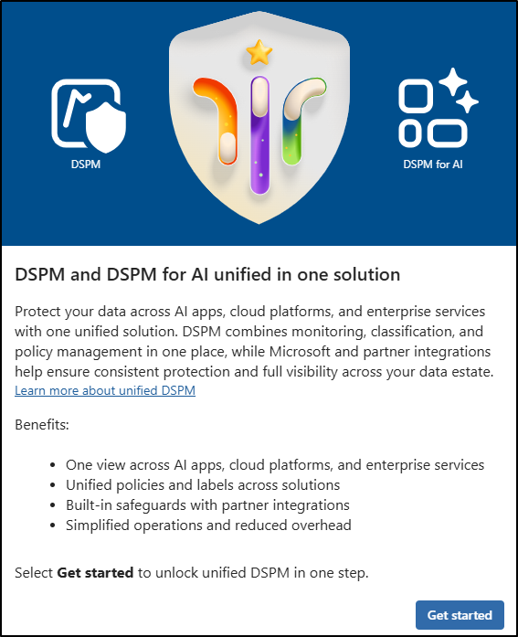

---
lab:
   title: Exercise 1 - Use Data Security Posture Management
   module: Module 6 - Protect data in AI environments
   description: Use Microsoft Purview Data Security Posture Management to complete setup, create a remediation policy, and run a data risk assessment for potential oversharing.
   duration: 60 minutes
   level: 200
   islab: true
   primarytopics:
      - Microsoft Copilot
      - Microsoft Purview
---

## WWL Tenants - Terms of use

If you are being provided with a tenant as part of an instructor-led training delivery, please note that the tenant is made available for the purpose of supporting the hands-on labs in the instructor-led training.

Tenants should not be shared or used for purposes outside of hands-on labs. The tenant used in this course is a trial tenant and cannot be used or accessed after the class is over and is not eligible for extension.

Tenants must not be converted to a paid subscription. Tenants obtained as part of this course remain the property of Microsoft Corporation and we reserve the right to obtain access and repossess at any time.

# Lab 6 - Exercise 1 - Use Data Security Posture Management

You are Joni Sherman, the Information Security Administrator for Contoso Ltd. As data moves across Microsoft 365, AI apps, and other connected services, your team needs practical ways to find and reduce sensitive data exposure. In this lab, you'll use Microsoft Purview Data Security Posture Management (DSPM) to complete setup, create a policy from a remediation action, and run an assessment for potential oversharing.

**Tasks**:

1. Complete DSPM setup
1. Create a remediation policy from DSPM
1. Create a data risk assessment for potential oversharing

**Estimated time:** 45-60 minutes

## Task 1 – Complete DSPM setup

Contoso is preparing for broader AI adoption, and the security team needs a unified view of data exposure before rollout. In this task, you enable the required analytics so DSPM can start gathering the signals it needs.

1. Sign into the Client 1 VM (SC-401-CL1) as the **SC-401-CL1\admin** account.

1. In **Microsoft Edge**, navigate to **`https://purview.microsoft.com`** and sign in as **Joni Sherman**, `JoniS@WWLxZZZZZZ.onmicrosoft.com` (where ZZZZZZ is your unique tenant prefix provided by your lab hosting provider). User account passwords are provided by your lab hosting provider.

1. In Microsoft Purview, select **Solutions** > **DSPM**.

   

1. On the **DSPM and DSPM for AI unified in one solution** page, select **Get started**.

1. On the **Complete setup to unlock the unified DSPM experience** page, review the required **Auditing and analytics** card. It confirms that Audit and Insider Risk Management analytics are already enabled and that DLP analytics will be enabled during setup.

1. Select **Start setup**.

> **Note: DSPM setup actions** Selecting **Start setup** enables any required analytics that aren't already enabled and starts the initial DSPM scan.

You've enabled DSPM analytics and started the initial scan that correlates sensitive-data risks across Microsoft Purview.

## Task 2 – Create a remediation policy from DSPM

Contoso wants to reduce the risk of employees using AI apps in ways that could create policy violations or unethical behavior. In this task, you select the remediation action that matches that business need and review the policy handoff to the owning Purview solution.

1. In **DSPM**, select **Tasks and actions** > **Remediation actions**.

1. Select the recommendation for **Detect unethical behavior in AI apps**.

1. Review the **Detect unethical behavior in AI apps** recommendation, then select **Create policies**.

1. Once your policy has been successfully created, navigate to **Solutions** > **Communication Compliance**.

1. In the **Communication Compliance** solution, select **Policies**.

1. Verify the **DSPM for AI - Unethical behavior in AI apps** policy was created from the remediation action.

You've used DSPM to convert a recommended remediation into a policy owned and managed by a Purview solution.

## Task 3 – Create a data risk assessment for potential oversharing

Contoso is preparing for broader Copilot and AI adoption, and wants to find content that may be accessible beyond the intended audience before those experiences expand. In this task, you create an assessment for unlabeled SharePoint content to identify the most likely oversharing risks.

1. In **DSPM**, select **Discover** > **Data risk assessments**.

1. Select **+ Create custom assessment**.

1. On the **Basic details** page, enter:

   - **Name**: `Unlabeled SharePoint Content Assessment`
   - **Description**: `Identifies unlabeled SharePoint content that could be overshared and helps prioritize remediation.`

1. Select **Next**.

1. On the **Add users** page, select **All**, then select **Next**.

1. On the **Add data sources to assess** page, select **SharePoint** and **OneDrive**, then select **Next**.

1. On the **Review and run the data assessment scan** page, review the assessment scope, then select **Save and run**.

1. On the confirmation page, select **Done**.

1. Back on the **Data risk assessments** page, select **Unlabeled SharePoint Content Assessment** to review its status and scope.

> **Note: Assessment scan processing time** The assessment scan can take time to complete. Review the assessment results after processing finishes to identify files that need labeling, access review, or other remediation.

You've created a DSPM data risk assessment that will identify potential oversharing risks in unlabeled SharePoint content. Use the results with the DSPM posture and objectives pages to prioritize appropriate labeling, DLP, and access-remediation actions.
