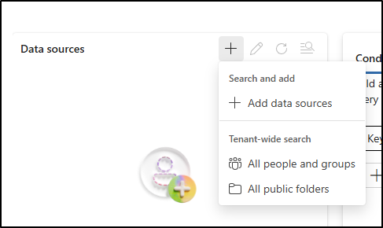

---
lab:
    title: 'Exercise 1 - Search the Audit log'
    module: 'Module 6 - Audit and search activity in Microsoft purview'
---

## WWL Tenants - Terms of use

If you are being provided with a tenant as a part of an instructor-led training delivery, please note that the tenant is made available for the purpose of supporting the hands-on labs in the instructor-led training.

Tenants should not be shared or used for purposes outside of hands-on labs. The tenant used in this course is a trial tenant and cannot be used or accessed after the class is over and are not eligible for extension.

Tenants must not be converted to a paid subscription. Tenants obtained as a part of this course remain the property of Microsoft Corporation and we reserve the right to obtain access and repossess at any time.

# Lab 6 - Exercise 1 - Search the Audit log

Contoso's information security team received an alert about the potential exposure of sensitive financial data. As the Information Security Administrator, you've been asked to perform a content search to determine if any content containing the phrase "confidential financial summary" was shared inappropriately across Microsoft 365 locations. The results will help identify possible policy violations and support a security investigation.

**Tasks**:

# Task 1 – 

1. Log into Client 1 VM (LON-CL1) as the **lon-cl1\admin** account.

1. In Microsoft Purview, sign out of Joni's account and close all browser windows.

1. In **Microsoft Edge**, navigate to **`https://purview.microsoft.com`** and log into the Microsoft Purview portal as **MOD Administrator** `admin@WWLxZZZZZZ.onmicrosoft.com` (where ZZZZZZ is your unique tenant ID provided by your lab hosting provider). Admin's password should be provided by your lab hosting provider.

1. In the left sidebar, select **Settings** > **Roles and Scopes** > **Role groups**.

1. On the **Role groups for Microsoft Purview solutions** page, search for `eDiscovery`, then select **eDiscovery Manager**.

1. On the **eDiscovery Manager** flyout panel, select **Edit**.

1. On the **Manage eDiscovery Manager** page, select **Choose users**.

1. On the **Choose users** flyout page, search for `Joni`, then select the checkbox for **Joni Sherman**. Select the **Select** button at the bottom of the panel.

1. Back on the **Manage eDiscovery Manager** page, select **Next**.

1. On the **Manage eDiscovery Administrator** page, select **Next**.

1. On the **Review the role group and finish** page select **Save**.

1. On the **You successfully updated the role group**, select **Done**.

1. Sign out of the MOD Administrator account by selecting the **MA** icon on the top right of the window, then select **Sign out**.

## Task 2

1. In Microsoft Edge, navigate to `https://purview.microsoft.com` and sign in to the Microsoft Purview portal as **Joni Sherman** `JoniS@WWLxZZZZZZ.onmicrosoft.com` (where ZZZZZZ is your unique tenant ID provided by your lab hosting provider). Joni's password was set in a previous exercise.

1. In Microsoft Purview, navigate to **Solutions** > **eDiscovery**.

1. On the **Cases** page, select the dropdown to the right of the **Create case** button to select **Create search**.

   

1. On the **Enter details to get started** dialogue, enter:

   - **Case name**: `Financial Content Investigation`
   - **Search name**: `Confidential Summary Search`
   - **Case description**: `Search to support audit of content containing confidential financial data.`
   - **Search description**: `Locate items containing the phrase “confidential financial summary” across mailboxes and SharePoint.`

1. Select **Create** to create the search.

1. On the **Confidential Summary Search** page, under **Data sources** select **+** (plus sign) > **Add data sources**.

   

1. On the **Search for sources** flyout, select the **Finance team** group, then select **Save and close**.

1. In Microsoft Edge, navigate to `https://purview.microsoft.com` and sign in to the Microsoft Purview portal as **Joni Sherman** `JoniS@WWLxZZZZZZ.onmicrosoft.com` (where ZZZZZZ is your unique tenant ID provided by your lab hosting provider). Joni's password was set in a previous exercise.

1. In Microsoft Purview, navigate to **Solutions** > **Audit**.

1. On the **Search** page, configure your search:

   - **Date and time range (UTC)**:

     - **Start date**: 3 days ago
     - **End date**: Today

   - **Activities – friendly names**: Search for `DLP` and select the following activities under **Information protection and DLP activities**:

     - Created DLP rule
     - Updated DLP rule
     - Deleted DLP rule
     - Created DLP policy
     - Updated DLP policy
     - Deleted DLP policy

   

   - **Search name**: `DLP Policy Activity`

1. Select **Search**.

1. It may take several minutes for the search to complete. While Audit processes your search, refresh the page to check the **Job status**, **Progress (%)**, and **Search time**.

1. Once complete, select **DLP Policy Activity** to view the results.

1. Select individual results to view detailed information about each DLP activity..

You've searched for and reviewed audit activity related to DLP policy and rule configuration.

## Task 2 – Export audit search results

In this task, you'll export the DLP audit search results for offline analysis or compliance record-keeping.

1. In Microsoft Purview, navigate to **Solutions** > **Audit**.

1. On the **Search** page, select the **DLP Policy Activity** search you created in the previous task.

1. Select **Export** at the top of the page.

1. In the confirmation dialog, select **OK** to start the export.

1. When the export completes, select the **Download file** link in the green **Your export is complete**. banner.

> **Note**: Audit export files are saved in CSV format and can be opened in any text editor or spreadsheet application. For easier review and filtering, many organizations use Excel or another spreadsheet tool. In this lab environment, you can open the CSV in Notepad to confirm that the export completed successfully.

You've exported DLP-related audit logs, which can be used for offline review or recordkeeping.

## Task 3 – Create an audit retention policy

In this task, you'll configure an audit retention policy to preserve logs related to DLP matches and actions for long-term investigation.

1. In Microsoft Purview, navigate to **Solutions** > **Audit**.

1. Select **Policies** from the left sidebar.

1. On the **Policies** page select **New audit retention policy**

1. On the **New audit retention policy** panel, enter:

   - **Policy name**: `Retain DLP Audit Logs`
   - **Description**: `Retains audit logs for DLP activities across Exchange, SharePoint, and endpoints to support investigation and compliance.`
   - **Users**: Leave blank to apply to all users
   - **Record Type**:
      - ComplianceDLPEndpoint
      - ComplianceDLPExchange
      - ComplianceDLPExchangeClassification
      - ComplianceDLPSharePoint
      - ComplianceDLPSharePointClassification
   - **Duration**: 1 year
   - **Priority**: `1`

1. Select **Save** to create the audit retention policy.

You've configured an audit retention policy that keeps logs of DLP matches and activity for one year.
