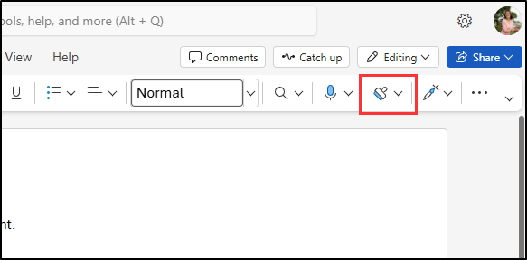
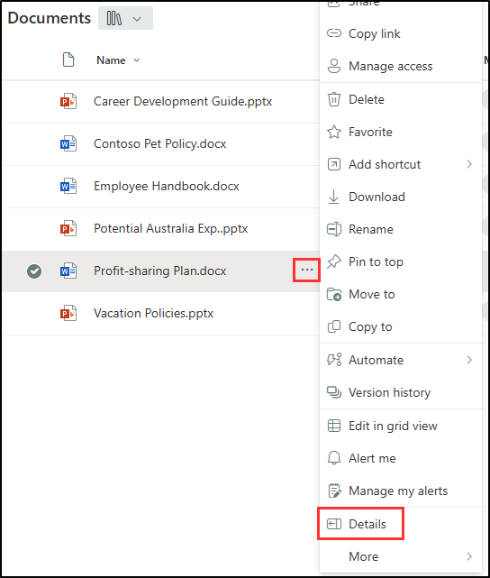

---
lab:
    title: 'Exercise 1 - Validate sensitivity, DLP, and retention policies'
    module: 'Policy validation - Validate sensitivity, DLP, and retention policies'
---

## WWL Tenants - Terms of use

If you are being provided with a tenant as a part of an instructor-led training delivery, please note that the tenant is made available for the purpose of supporting the hands-on labs in the instructor-led training.

Tenants should not be shared or used for purposes outside of hands-on labs. The tenant used in this course is a trial tenant and cannot be used or accessed after the class is over and are not eligible for extension.

Tenants must not be converted to a paid subscription. Tenants obtained as a part of this course remain the property of Microsoft Corporation and we reserve the right to obtain access and repossess at any time.

# Validation lab - Validate sensitivity, DLP, and retention policies

You are Joni Sherman, the Information Security Administrator at Contoso Ltd. Now that you've configured sensitivity labels, data loss prevention (DLP), and retention policies, you've been asked to validate that those configurations are working as expected. In this lab, you'll test the behavior of each policy in Microsoft 365 apps and verify that content is protected and retained according to your policy settings.

**Tasks**:

1. Apply a sensitivity label in Word
1. Trigger a DLP policy in Outlook
1. Apply retention and sensitivity labels in SharePoint

## Task 1 – Apply a sensitivity label in Word

In this task, you'll verify that published sensitivity labels are available to users and can be applied directly from Microsoft Word.

1. You should still be logged into Client 1 VM (SC-401-CL1) as the **SC-401-CL1\admin** account, and you should be logged into Microsoft 365 as **Joni Sherman** `JoniS@WWLxZZZZZZ.onmicrosoft.com` (where ZZZZZZ is your unique tenant ID provided by your lab hosting provider). Joni's password was set in a previous exercise.

1. In Microsoft Edge, select the app launcher in the top left and choose **Word**.

    

1. Select **Blank document**.

1. If prompted, close the **Your privacy options** dialog.

1. Enter the following text into the document:

   `Important HR employee document.`

1. Select **Sensitivity** from the navigation ribbon and select **Internal** > **Employee Data (HR)** to apply the newly created sensitivity label to this document.

    

    > [!Note] It can take 24-48 hours for newly published sensitivity labels to be available for application. If the newly created sensitivity labels aren't available, you can use **Confidential** > **All Employees** for this exercise.

1. Change the sensitivity label to **Public** to verify the business justification dialog appears.

1. Select **Cancel** to keep the sensitivity label.

1. In the upper left of the document, select **Document** to rename this file, and rename it to **`HR Document`**. Press enter to apply this name change.

    

You've verified that the HR sensitivity label is available and applies the appropriate protections to a Word document.

## Task 2 – Trigger a DLP policy in Outlook

Next, you'll send sensitive employee information in an email to verify that your DLP policy correctly detects and blocks the activity.

1. You should still be logged into Client 1 VM (SC-401-CL1) as the **SC-401-CL1\admin** account and logged into Microsoft 365 as Joni Sherman.

1. In Microsoft Edge, select the app launcher in the top left and choose **Outlook**.

1. Select the **New mail** button on the top left to compose a new email message.

1. In the **To** field, enter `Megan` and select **Megan Bowen**'s email address.

1. In the subject field enter `Help with employee information`.

1. In the body of the email enter:

   ``` text
   Please help me with the start dates for the following employees:
   ABC123456
   DEF678901
   GHI234567

   Thank you, 
   Joni Sherman
   ```

1. Select the **Send** button in the upper right of the message window to send the email.

1. You should receive a message that the email was undeliverable and blocked by a DLP policy.

   

You've confirmed that your DLP policy blocked the transmission of sensitive employee IDs through email.

## Task 3 – Apply retention and sensitivity labels in SharePoint

To test your retention configuration, you'll apply a retention label to a document stored in SharePoint and verify that sensitivity labels are also available.

1. You should still be logged into Client 1 VM (SC-401-CL1) as the **SC-401-CL1\admin** account and logged into Microsoft 365 as Joni Sherman.

1. In Microsoft Edge, select the app launcher in the top left and choose **SharePoint**.

1. On the SharePoint landing page, search for `Benefits` then select **Benefits @ Contoso** from the search results.

1. Select **Documents** from the left pane.

1. On the **Documents** page, select the ellipsis next to **Profit-sharing Plan.docx**, then select **Details**.

   

1. In the **Details** panel, update the following fields:
   - **Sensitivity**: Confidential - Finance
   - **Apply label**: Sensitive Financial Records

     

You've confirmed that retention and sensitivity labels are available and can be applied to SharePoint documents.

